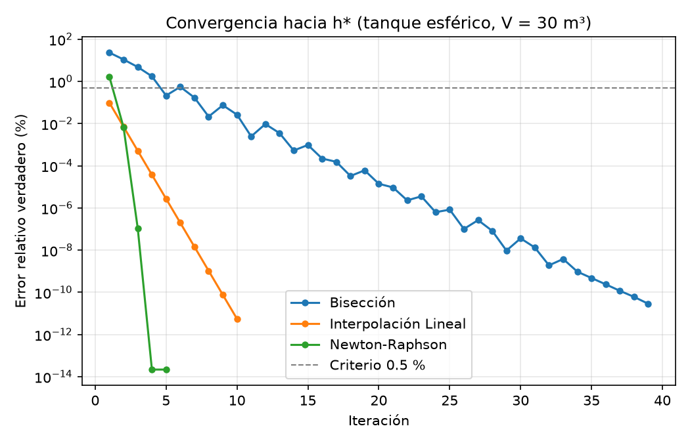

# Proyecto: Aplicación de Métodos Numéricos — Tanque Esférico

**Universidad Monteávila** · Métodos Numéricos · Prof. Boris Bossio
Autor: Luis Eulacio

## El reto

Se necesita calibrar un sensor de presión en un tanque de agua esférico de radio **R = 3 m**.
El sensor debe activarse cuando el volumen almacenado sea **V = 30 m³**. El volumen de un
casquete esférico de profundidad `h` es:

$$V = \frac{\pi h^2 (3R - h)}{3}$$

El objetivo es hallar `h` resolviendo la ecuación no lineal asociada con tres métodos
numéricos, usando como criterio de parada un **error relativo aproximado < 0.5 %**.

## A) Planteamiento

Sustituyendo R = 3 y V = 30:

$$f(h) = \frac{\pi h^2 (9 - h)}{3} - 30 = 0$$

$$f'(h) = \pi h (6 - h) \qquad f''(h) = \pi (6 - 2h)$$

- Dominio físico: `0 ≤ h ≤ 2R = 6`.
- Como `f'(h) > 0` en `(0, 6)`, `f` es estrictamente creciente; con `f(0) = -30 < 0` y
  `f(6) = 36π - 30 > 0` existe **una única raíz física**.
- Intervalo inicial (primer subintervalo de longitud 1 con cambio de signo): **[2, 3]**,
  con `f(2) = -0.6785` y `f(3) = 26.5487`.
- Semilla de Newton-Raphson: `h0 = 3`.

## Estructura del proyecto

| Archivo | Contenido |
|---|---|
| `problema.py` | Constantes (R, V, TOL, dominio), `f`, `f'`, `f''`, intervalo inicial y semilla |
| `utils.py` | `Resultado`, error relativo, búsqueda de intervalo, impresión de tablas |
| `biseccion.py` | B) Método de Bisección |
| `interpolacion_lineal.py` | C) Método de Interpolación Lineal (Falsa Posición) |
| `newton_raphson.py` | D) Método de Newton-Raphson |
| `verificacion.py` | Verificación con NumPy/SciPy, orden de convergencia y gráfica |
| `main.py` | Ejecuta todo (A–E) e imprime la conclusión |
| `convergencia.png` | Gráfica de error verdadero vs. iteración (se genera al ejecutar) |
| `pyproject.toml` | Metadatos, dependencias y comando `tanque-esferico` |
| `requirements.txt` | Dependencias (alternativa a `pyproject.toml`) |

## Instalación y ejecución

```bash
python3 -m venv .venv
source .venv/bin/activate
pip install -e .                # instala dependencias y el comando del proyecto

tanque-esferico                 # proyecto completo (A–E + verificación)
python main.py                  # equivalente, sin instalar el paquete
                                # (alternativa: pip install -r requirements.txt)
python biseccion.py             # cada método por separado
python interpolacion_lineal.py
python newton_raphson.py
```

Requiere Python 3.10+ y las librerías `numpy`, `scipy` y `matplotlib`.

## Resultados

### B) Bisección — 7 iteraciones

| Iter | a | b | c | f(a) | f(c) | Error (%) |
|---|---|---|---|---|---|---|
| 1 | 2.000000 | 3.000000 | 2.500000 | -0.678469 | 12.542401 | --- |
| 2 | 2.000000 | 2.500000 | 2.250000 | -0.678469 | 5.784704 | 11.111111 |
| 3 | 2.000000 | 2.250000 | 2.125000 | -0.678469 | 2.510166 | 5.882353 |
| 4 | 2.000000 | 2.125000 | 2.062500 | -0.678469 | 0.904344 | 3.030303 |
| 5 | 2.000000 | 2.062500 | 2.031250 | -0.678469 | 0.109966 | 1.538462 |
| 6 | 2.000000 | 2.031250 | 2.015625 | -0.678469 | -0.285006 | 0.775194 |
| 7 | 2.015625 | 2.031250 | 2.023438 | -0.285006 | -0.087708 | 0.386100 |

**h ≈ 2.023438 m**

### C) Interpolación Lineal (Falsa Posición) — 2 iteraciones

| Iter | a | b | c | f(a) | f(c) | Error (%) |
|---|---|---|---|---|---|---|
| 1 | 2.000000 | 3.000000 | 2.024919 | -0.678469 | -0.050255 | --- |
| 2 | 2.024919 | 3.000000 | 2.026761 | -0.050255 | -0.003658 | 0.090898 |

**h ≈ 2.026761 m**

### D) Newton-Raphson (h0 = 3) — 3 iteraciones

| Iter | h_i | f(h_i) | f'(h_i) | h_i+1 | Error (%) |
|---|---|---|---|---|---|
| 1 | 3.000000 | 26.548668 | 28.274334 | 2.061033 | 45.558080 |
| 2 | 2.061033 | 0.866921 | 25.504520 | 2.027042 | 1.676871 |
| 3 | 2.027042 | 0.003449 | 25.300354 | 2.026906 | 0.006726 |

**h ≈ 2.026906 m**

### Verificación independiente (NumPy / SciPy)

| Herramienta | h* |
|---|---|
| `numpy.roots` (raíces de la cúbica) | 2.026905728310 |
| `scipy.optimize.brentq` | 2.026905728310 |
| `scipy.optimize.newton` | 2.026905728310 |

### Comparación

| Método | Iter. (0.5 %) | Evals. de f | Error verdadero | Iter. (1e-10 %) | Orden p empírico |
|---|---|---|---|---|---|
| Bisección | 7 | 9 | 1.7e-1 % | 39 | 0.99 |
| Interpolación Lineal | **2** | **4** | 7.1e-3 % | 10 | 1.00 |
| Newton-Raphson | 3 | 6 | 1.1e-7 % | **5** | **1.99** |

El orden `p` se estima como la pendiente de la regresión de `log(e_{k+1})` frente a
`log(e_k)`, donde `e_k` es el error verdadero respecto a la raíz de referencia.



## E) Conclusión

Con el criterio exigido (**Error < 0.5 %**), el método más eficiente fue
**Interpolación Lineal** (2 iteraciones, 4 evaluaciones de función).

**¿Por qué?** La raíz (h* ≈ 2.0269) está muy cerca de `a = 2` (|f(a)| = 0.678 frente a
f(b) = 26.55) y en [2, 3] la curvatura es pequeña comparada con la pendiente
(f'' ≤ 6.28 frente a f' ≈ 25.3). Por eso la recta secante cae prácticamente sobre la raíz
desde la primera iteración; la segunda solo confirma que el error ya es menor a 0.5 %.

- **Bisección** no usa los valores de f: solo parte el intervalo a la mitad, por lo que
  converge linealmente con razón ½, independientemente de la forma de f.
- **Newton-Raphson** empezó en h0 = 3, lejos de la raíz, y su criterio de parada necesita
  una iteración extra para comparar dos valores consecutivos.
- Como `f'' > 0` en el intervalo, la **Falsa Posición** deja fijo el extremo `b = 3` y su
  convergencia es solo **lineal**.

A largo plazo, con tolerancia estricta (1e-10 %), gana **Newton-Raphson**: su convergencia
es **cuadrática** (p ≈ 2), es decir, los dígitos correctos se duplican en cada paso, mientras
que Bisección y Falsa Posición convergen linealmente (p ≈ 1).

**En resumen:** para este problema con 0.5 % gana Interpolación Lineal. Como método general,
si se conoce f'(h) analíticamente y se tiene una semilla razonable, Newton-Raphson es el más
eficiente, y Bisección es el más robusto porque su convergencia está garantizada.

> **Profundidad del agua para V = 30 m³: h ≈ 2.0269 m**
